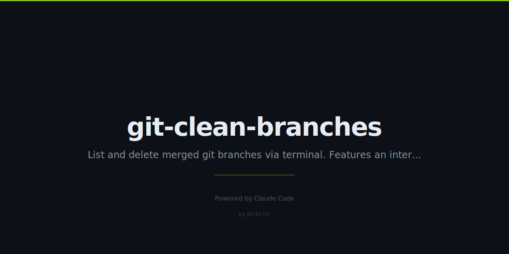

# git-clean-branches

> List and delete merged and stale git branches. Interactive TUI. Zero dependencies.

## Install

```bash
# Run without installing
npx git-clean-branches

# Install globally
npm install -g git-clean-branches
```

## Quick Start

```bash
# Interactive TUI — pick branches visually
gcb

# List merged branches (non-interactive)
gcb --merged

# List branches with no commits in 30 days
gcb --stale 30

# Delete merged branches (with confirmation)
gcb --merged --delete

# Preview what would be deleted
gcb --merged --delete --dry-run
```

## TUI Demo

```
  git-clean-branches
  Base: main  |  Current: feature/payment
  ↑/↓ Navigate  ·  Space Select  ·  Enter Delete selected  ·  q Quit

  Branch                              Last commit     Author              Status        Ahead/Behind
  ────────────────────────────────────────────────────────────────────────────────────────────────
  [ ] main                           (protected)
  [ ] develop                        (protected)
  [ ] feature/payment                (protected, current)

  [ ] fix/login-bug                  3 days ago      Nick Ashkar         ✓ merged      +0 / -0
  [ ] feature/old-api                45 days ago     Nick Ashkar         ✗ unmerged    +3 / -0
> [✗] chore/temp-test                2 months ago    Nick Ashkar         ✓ merged      +0 / -0
  [✗] hotfix/typo                    5 days ago      Nick Ashkar         ✓ merged      +0 / -0

  2 branches selected for deletion  [Enter to delete]
```

Branch colors:
- **Green** = merged into base branch (safe to delete)
- **Yellow** = stale or unmerged (verify before deleting)
- **Red** = selected for deletion
- **Gray** = protected (cannot be selected)

## Options

| Flag | Description |
|---|---|
| `--merged` | Filter: only branches merged into current |
| `--stale <days>` | Filter: no commits in last N days |
| `--delete` | Delete matching branches (asks confirmation) |
| `--remote` | Also delete remote tracking branches |
| `--dry-run` | Preview what would be deleted, no actual deletion |
| `--protect <list>` | Comma-separated protected branches (default: `main,master,develop`) |
| `--format json` | Output JSON instead of table |
| `-h, --help` | Show help |

## Examples

```bash
# Delete all merged branches, skip confirmation prompt interactively
gcb --merged --delete

# Nuke stale remote branches older than 60 days (dry run first)
gcb --stale 60 --delete --remote --dry-run
gcb --stale 60 --delete --remote

# Custom protection list
gcb --merged --delete --protect "main,master,develop,release"

# Machine-readable output for scripting
gcb --merged --format json | jq '.[].name'
```

## Security

- Uses `execFileSync` / `spawnSync` — no shell injection possible
- No network requests — 100% local git commands
- Never deletes the current branch or protected branches
- Always asks for confirmation before any deletion
- `--dry-run` flag to preview safely

## Why?

After months of development, repos accumulate dozens of stale branches. `git branch -d` is tedious one-by-one. This tool gives you a visual overview and lets you bulk-clean safely — merged branches only, with a confirmation step before anything is removed.

No npm install needed. Zero external dependencies. Works anywhere Node 18+ is available.

---

Built with Node.js · Zero dependencies · MIT License
